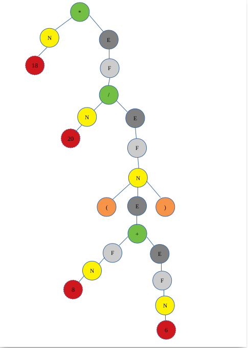

# Compiler and  Interpreter 

The difference between interpreter and compiler is the first one analyze and understand the code then run the command directly while the compiler analyse and understand the code then convert it to binary code which runs later the compiler is much faster than interpreter because it makes the lexical analysis and parse tree for once and create executable file than run directly while interpreter makes the lexical analyze and parse tree each time you run the code.

in this project we build interpreter for this languge:
it's similar to python
if you wont define function you start with "def" then (paraemter,..) then -->  then function name  and the last is ':'

ex:                                                                      
    
    def(a,b)-->sum:                                  
    return a+b

in this languge we handel the scope if and only if the previous statment end.
the function end with 'return' the for loop and while and if end with '!' and the statment end with ';'

the for is '&' and the start index --> then the stop inex and ':'

ex:

    & i=1-->10:
    <--i;
    !
    
the example print the number from 1 to 10 and the 'END' determine that the loop is finished.

the while is @ then ( condition ) then ':'

ex:

    @(i<5):
    do 
    !

the if statment is '?' then (condition) then ':' and for else '??'

ex:

    ? (i<25):
    do 
    ??
    do 
    !
for write <-- and the ';'

ex:                                                                               
        
    <--i;
    
define a Identifire we use two way first one as c++ we determine the type of this parameter or like python.

ex:                                                                     
            
    string t:="hello";                                         
    g:="hello";                                                    
    k:=25;                                        
    int l:=65;                                            

in this languge you can define a function inside another function.
    
How compiler work:

1-lexical analyses:
in this step we break the code into tokens, we define these tokens to represent our language so in this step we determine  if all token belongs to our language and this happen using DFA (Deterministic Finite Automaton )

2-syntax analyses:
in this step, we check if each command have been written in the right way as we define the rule of language and this is done using a context-free grammar

after this step, we build the parse tree, and then the compiler converts this tree to another language while the interpreter executes this tree.
 
for this project we use javacc in the **eclipsey IDE** you whatch this video https://www.youtube.com/watch?v=NGtRVHG1DdI to learn to install javacc.

**javacc** is tool that generates lexical analyzer and parses tree  so you just need to provide the regular expressions 
and the javacc make all works for you.

### Add Token 
as any language containe words we need to add words to our languge.

in the AINL.jj file we wrote the grammar.     

as we can see in Token section where we define our language you can create your own words and build your language by put the syntax and the grammar of the languge.

Token **PLUS** contains **- and +** if we diffine in this way it's simpler for writing grammer and because have the same priority as we can see we did the same trick for **MULTIPLY**.
the order you but the token is mater so be cerful while you diffine your token the most general token most be the last one.

### Grammer

after that we write the grammar, when we write grammar we should be careful that the grammar has ambiguity, if that happens we will generate a different parse tree for the same rule and that means if we write a program in this language this program will execute differently each time.
for example, we will write Expreation:
if we wrote   **E-> E+E | ExE | NUM**
as we can see this rule has ambiguity, so we need to write the rule to remove the ambiguity.

**E-> F+E | F      
  F-> N*E | N       
  N-> NUM | (E)**    

now if we wont to build the parse tree for this Expreation 18*20/(8+6) we get this tree:

how to convert this rule in the code we define the grammar like that for example, we want to write the if rule :

void if_statment():
{
   ///unused in the syntax analyse
}

{
< IF > fullcondation()
(statement())+
(< ELSE > (statement())+)?
< END >

}

everything between <> is Token, the class  statment() is represents all syntax of language and fullcondation() is the class of the condition to run if.

after we define all rule we want in our language we now need to build **Abstract syntax tree**.

as we can see in the project in **src** folder we have **node** and **newLang**
the newLang folder have AILN.jj file where we write the syntax and the rule of the languge while the **node** is where we build the Abstract syntax tree where each class represent a node in the tree and and each node have deffrent logic from there cosine after we write all class now we make return the node from the same type for example in the previos section where we show how to write the if_statment() we return void but now we return **IF** is the class where we write how **if** node acts and what should return. 

now you can build a interpreter and write your own languge I hope you find this project useful and if there is any bugs I will be very happay if you send me email to correct it

email: khalil.hennara.247@gmail.com

